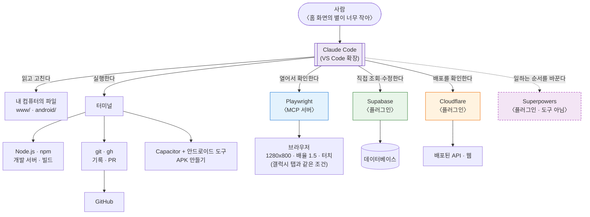
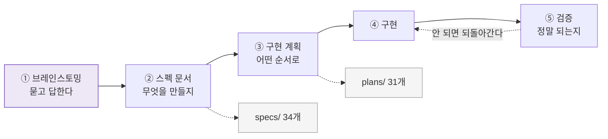
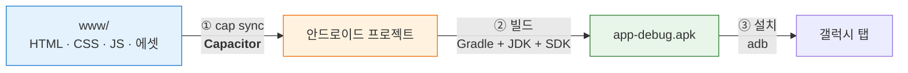

# 개발 환경 — 무엇이 왜 필요한가

이 프로젝트를 **채팅으로 만들기 위해(바이브 코딩)** 갖춘 환경을 설명한다.
Windows 기준이고, 개발이 전문이 아닌 사람을 대상으로 한다.

**설치 안내서가 아니다.** 어디서 받아 어떤 버튼을 누르는지는 각 도구의 공식 문서가 더 정확하고
최신이다. 이 글이 답하려는 것은 **"이게 왜 필요하고, 채팅으로 코딩할 때 무슨 역할을 하는가"** 다.

git 자체가 처음이라면 [Git과 GitHub 안내](git-basics.md)를 먼저 보는 편이 낫다.

> **여기서 말하는 "Claude Code"**
> 웹 브라우저에서 쓰는 Claude와 같은 AI지만, **내 컴퓨터 안에서 도는 버전**이다.
> 그래서 파일을 직접 열어 고치고, 명령을 실행하고, 브라우저를 띄워 볼 수 있다.
> 웹에서 쓰는 Claude는 대화창 안에만 있어서 내 컴퓨터에 손을 댈 수 없다.
> 이 문서가 설명하는 도구들은 전부 **Claude Code가 쓸 수 있게** 붙이는 것이다.

---

## 1. 바이브 코딩이면 환경을 갖추는 이유가 달라진다

보통의 개발에서는 사람이 코드를 쓰고, 사람이 실행해 보고, 사람이 확인한다.
그래서 도구는 **사람이 쓰려고** 설치한다.

채팅으로 코딩할 때는 다르다. 사람은 **무엇을 원하는지 말하고**, 코드를 쓰고 실행하고
확인하는 일은 Claude Code가 한다. 그래서 도구를 설치하는 목적이 바뀐다.

> **내가 쓸 도구가 아니라, Claude Code가 쓸 도구를 갖추는 일이다.**

이 한 가지가 아래 모든 선택의 이유다. 판단 기준도 단순해진다.

| | 그 도구가 없으면 | 그 도구가 있으면 |
| --- | --- | --- |
| Claude Code는 | **"이렇게 하세요"라고 말만 한다** | **직접 한다** |
| 사람은 | 시키는 대로 따라 하고 결과를 채팅에 옮겨 적는다 | 결과를 보고 판단만 한다 |

도구를 하나 붙일 때마다 **사람이 손으로 옮겨 적던 일이 하나씩 사라진다.**

## 2. 전체 그림 — Claude Code에게 쥐여 주는 네 가지

사람이 한 문장을 말하면, Claude Code 가 네 방향으로 손을 뻗는다.
**어떤 도구가 어디에 닿는지**를 한 장에 그리면 이렇다.

점선으로 이어진 **Superpowers만 성격이 다르다.** 나머지는 Claude Code 가 *무언가에 닿게* 해 주는
도구인데, 이것은 닿을 곳을 늘리지 않고 **일하는 순서**만 바꾼다.

| Claude Code가 하는 일          | 그래서 필요한 것                          |
| ------------------------- | ------------------------------------------ |
| 파일을 읽고 고친다        | VS Code + Claude Code 확장                 |
| 명령을 실행한다           | Node.js · npm · git · gh                   |
| 브라우저로 확인한다       | Playwright **MCP 서버**                     |
| 바깥 서비스를 다룬다      | Supabase · Cloudflare **플러그인**          |
| APK를 만든다              | Capacitor + 안드로이드 빌드 도구 (웹으로만 볼 거면 불필요) |

## 3. VS Code + Claude Code 확장 — 작업이 벌어지는 자리

**VS Code**는 파일을 보고 고치는 프로그램이다. 워드가 문서를 다루듯, 코드 파일을 다룬다.

**Claude Code 확장**은 그 VS Code 안에서 Claude Code와 대화하는 창이다.

웹 브라우저에서 쓰는 보통의 Claude로도 대화할 수 있는데 왜 굳이 여기서 하는가.

> **내 컴퓨터의 파일을 Claude Code가 직접 읽고 고칠 수 있기 때문이다.**

웹에서는 파일 내용을 복사해서 붙여 넣고, 답변을 다시 복사해서 파일에 옮겨야 한다.
확장에서는 그 왕복이 사라진다. Claude Code가 폴더를 직접 뒤져 필요한 파일을 찾고, 고치고,
무엇을 고쳤는지 화면에 표시한다.

**코드를 직접 타이핑하지 않아도, 무엇이 바뀌었는지는 눈으로 볼 수 있다.**
바뀐 줄이 색으로 표시되므로 "뭘 했는지 모르겠는" 상태가 되지 않는다.

## 4. Node.js — 앱의 재료가 아니라, 공구를 돌리는 전기

혼란스러운 지점이 하나 있다. **이 앱은 Node.js로 만들어지지 않았다.**
게임은 순수 HTML·CSS·JavaScript이고 빌드 단계도 없다. 그런데 왜 Node.js를 설치하는가.

**개발할 때 쓰는 도구들이 전부 Node.js 위에서 돌기 때문이다.**

| 도구          | 하는 일                                   |
| ------------- | ------------------------------------------ |
| `npm`         | 필요한 도구를 내려받고 버전을 관리한다      |
| browser-sync  | 내 컴퓨터에서 게임을 띄워 보는 개발용 서버  |
| Capacitor CLI | 웹앱을 안드로이드 프로젝트로 옮길 때          |
| Playwright    | 브라우저를 열어 확인할 때                   |

즉 Node.js는 **앱의 재료가 아니라 공구를 돌리는 전기**다.
완성된 APK 안에는 Node.js가 들어가지 않는다.

## 5. git과 gh — 기록하고, 올리고, 확인하고

**git**은 변경 이력을 기록하는 도구다. ([자세히](git-basics.md))

**gh**는 GitHub CLI, 즉 **GitHub를 명령어로 다루는 프로그램**이다.
여기서 짚어 둘 것 — **gh는 MCP도 플러그인도 아니다.** 그냥 컴퓨터에 설치된 프로그램이고,
Claude Code가 터미널을 통해 부른다.

없어도 코딩은 된다. 있으면 이런 일들이 Claude Code 손에서 끝난다.

- 작업을 마치고 **PR을 직접 올린다**
- PR에 달린 코멘트를 **읽고 반영한다**
- 예전 PR을 뒤져 "이 코드가 왜 들어왔는지" 찾아본다

## 6. Claude Code에 연결한 도구들 — MCP와 플러그인

### 먼저 이름부터 — 셋은 서로 다른 것이다

가장 헷갈리는 대목이다. 셋 다 "Claude Code가 쓰는 도구"지만 **붙이는 방식이 다르다.**

| 종류                | 무엇인가                                                     | 이 프로젝트에서        |
| ------------------- | ------------------------------------------------------------- | ---------------------- |
| **MCP 서버**        | Claude Code가 외부 프로그램·서비스를 다룰 수 있게 연결하는 **규격** | Playwright             |
| **플러그인**        | 여러 가지를 묶어 **한 번에 설치하는 꾸러미**. 도구(MCP 서버)가 들어 있기도 하고, **일하는 방법**만 들어 있기도 하다 | Cloudflare · Supabase · Superpowers |
| **그냥 명령어 도구** | 컴퓨터에 설치된 보통의 프로그램. Claude Code가 터미널로 부른다      | gh · node · npm        |

**플러그인 안에 MCP 서버가 들어 있다.** 그래서 "Cloudflare MCP"라고 불러도 말은 통하지만,
설치하고 켜고 끄는 단위는 **플러그인**이다. 이 차이를 알아 두면 설정을 찾을 때 헤매지 않는다.

플러그인이라고 다 도구를 붙여 주는 것도 아니다. Cloudflare와 Supabase는 **도구**를 붙여 주지만,
아래 나올 Superpowers는 도구가 하나도 없고 **일하는 순서**만 붙여 준다.

- MCP 서버는 프로젝트 폴더의 `.mcp.json`이나 Claude Code 전체 설정에 적는다
- 플러그인은 마켓플레이스에서 설치하고 설정에서 켠다

### Playwright MCP — Claude Code의 눈

Claude Code가 **브라우저를 직접 열어 클릭하고, 스크린샷을 찍는** 도구다.

이게 없으면 화면을 고칠 때마다 이렇게 된다 — Claude Code가 코드를 고친다 → 사람이 브라우저를
새로고침한다 → 사람이 눈으로 본다 → **"글자가 밑에서 잘려요"라고 채팅에 적는다** → Claude Code가
다시 고친다. 화면 하나 맞추는 데 이 왕복이 열 번씩 돈다.

Playwright가 붙으면 **Claude Code가 직접 열어 보고, 잘린 것을 자기 눈으로 확인하고, 고친다.**

이 프로젝트에서는 한 발 더 나갔다. 브라우저를 열 때의 조건을 이렇게 고정해 두었다.

| 설정         | 값          | 왜                                  |
| ------------ | ----------- | ------------------------------------ |
| 화면 크기    | 1280 × 800  | 갤럭시 탭 A9+ 의 화면과 같은 값       |
| 화면 배율    | 1.5         | 같은 태블릿의 배율                    |
| 터치         | 켬          | 마우스가 아니라 손가락으로 쓰는 기기   |

즉 **태블릿 없이도 태블릿과 같은 조건에서 확인**할 수 있다.
실제 기기는 마지막에 한 번만 확인하면 된다.

### Supabase 플러그인 — 데이터베이스를 대시보드 없이 다루기

여기가 이 환경에서 효과가 가장 컸던 부분이다.

데이터베이스 작업은 보통 **Supabase 대시보드**라는 웹 화면에서 한다.
표를 만들고, 칸을 추가하고, 누가 무엇을 볼 수 있는지 규칙을 쓰고, 값을 조회하는 화면들이다.
개발에 익숙한 사람에게는 편리한 도구지만, **처음 보는 사람에게는 어디를 눌러야 할지 알 수 없다.**
용어(스키마 · 정책 · 외래 키)부터 낯설고, 잘못 누르면 데이터가 지워질 수도 있어 손대기가 무섭다.

플러그인이 붙으면 **그 화면에 들어갈 일이 거의 없다.** 하고 싶은 말을 하면 된다.

| 하고 싶은 것   | 원래는                              | 채팅으로는                            |
| -------------- | ----------------------------------- | -------------------------------------- |
| 표 만들기      | 대시보드에서 칸을 하나씩 정의한다    | "학생 정보를 담을 표가 필요해"          |
| 칸 추가하기    | 표 설정을 열어 칸을 더한다           | "성별을 저장할 칸을 추가해 줘"          |
| 권한 규칙      | 접근 정책을 직접 작성한다            | "선생님은 자기 반 학생만 보이게 해 줘"  |
| 데이터 확인    | 표를 찾아 들어가 값을 읽는다         | "3반 학생들 진도 어떻게 돼?"            |
| 문제 점검      | 설정을 하나씩 살펴본다               | "보안상 문제될 설정 있어?"              |

**말로만 그런 게 아니라 실제로 그렇게 만들어졌다.**
이 데이터베이스에는 지금까지의 변경 기록 **26건**이 남아 있는데, 이름만 봐도 무슨 일을 했는지 보인다.

| 기록에 남은 이름                        | 무슨 일을 했나                          |
| --------------------------------------- | ---------------------------------------- |
| `create_schools_table`                  | 학교 표 만들기                           |
| `create_profiles_table`                 | 학생 표 만들기                           |
| `enable_rls_profiles`                   | 학생 표에 접근 규칙 켜기                 |
| `create_handle_new_user_trigger`        | 가입하면 선생님 줄이 자동으로 생기게      |
| `add_gender_to_profiles`                | 학생 표에 성별 칸 추가                   |
| `replace_rls_policies_for_teacher_scope` | 선생님이 자기 반만 보도록 규칙 교체      |
| `restrict_signup_to_korea_kr`           | 가입을 국내로 제한                       |

표를 만드는 일부터 나중에 칸을 더하는 일, 권한 규칙을 바꾸는 일, 보안을 조이는 일까지
**전부 대화로 이루어졌다.**

[기술 및 서비스 구성](tech-stack.md)에서 "선생님은 자기 반 학생만 보이고, 그걸 화면이 아니라
**데이터베이스가 보장한다**"고 설명한 그 장치도 이렇게 만들어진 것이다.

> **핵심**
> 데이터베이스를 다루려면 원래 **무엇을 원하는지**와 **어떻게 하는지** 둘 다 필요하다.
> 플러그인이 붙으면 **앞쪽만 있으면 된다.**

### Cloudflare 플러그인 — 배포 상태를 대시보드 없이 확인하기

같은 이야기가 Cloudflare 쪽에도 적용된다.

API 서버(Workers)와 웹(Pages)이 Cloudflare에 올라가 있다. 상태를 보려면 원래
**Cloudflare 대시보드**에 로그인해서 메뉴를 찾아 들어가야 하는데, 여기도 화면이 많고 용어가 낯설다.
"배포가 된 건지 아닌지"조차 어디를 봐야 하는지 알기 어렵다.

| 확인하고 싶은 것       | 원래는                             | 채팅으로는                        |
| ---------------------- | ---------------------------------- | ---------------------------------- |
| 배포가 됐나            | 대시보드에서 배포 목록을 찾는다     | "배포됐어?"                        |
| 왜 실패했나            | 빌드 기록 화면을 열어 읽는다        | "빌드 왜 실패했는지 봐 줘"         |
| 지금 올라간 게 맞나    | 대시보드에서 올라간 코드를 확인한다 | "지금 올라간 버전 확인해 줘"       |
| 설정을 어떻게 하지     | 공식 문서를 검색해 읽는다           | Claude Code가 최신 문서를 직접 찾는다 |

마지막 줄이 생각보다 크다. AI는 학습한 시점 이후에 바뀐 것을 모르는데,
이 플러그인이 붙으면 **Cloudflare 공식 문서를 그 자리에서 찾아보고 답한다.**
오래된 방식으로 알려 줄 위험이 줄어든다.

다만 Supabase만큼 자주 쓰이지는 않았다. 데이터베이스는 기능을 만들 때마다 들여다볼 일이 있지만,
**배포는 잘 돌아가는 동안에는 확인할 일이 없기 때문**이다.

### 두 경우의 공통점

비개발자에게 진짜 벽은 "무엇을 하고 싶은지 모르는 것"이 아니다.

> **"그걸 어느 화면의 어느 버튼으로 해야 하는지 모르는 것"이 벽이다.**
> 플러그인은 그 화면과 버튼을 건너뛰게 해 준다.

대시보드에서만 할 수 있는 일도 남아 있지만, **만들면서 매일 하는 일은 대부분 대화로 끝난다.**

### 설치돼 있지만 이 프로젝트에선 안 쓰는 것

Vercel 플러그인도 깔려 있지만 이 프로젝트에서는 쓰지 않는다.
다른 작업에 쓰려고 설치해 둔 것이다. **깔려 있다고 다 쓰는 것은 아니다.**

### Superpowers 플러그인 — 도구가 아니라 "일하는 방법"

앞의 것들과 성격이 다르다. **새 도구를 하나도 붙여 주지 않는다.**
대신 Claude Code가 **일을 진행하는 순서**를 바꾼다. (MCP 서버 없이 작업 방법 15가지만 들어 있다.)

비개발자가 AI와 일할 때 가장 크게 막히는 지점은 이것이다.

> 무엇을 만들고 싶은지는 있는데, **그걸 어떻게 설명해야 할지 모른다.**

"미션을 하나 더 만들고 싶어"라고만 말하면 AI는 나름대로 추측해서 만들어 온다.
그런데 막상 보면 생각한 것과 다르다. 다시 설명하고, 또 다르고, 이 왕복이 반복된다.
**문제는 AI가 못 알아들은 게 아니라, 말한 사람도 아직 다 정하지 못한 상태였다는 것이다.**

#### 1단계 — 브레인스토밍: 만들기 전에 묻는다

Superpowers를 켜면 Claude Code가 **바로 만들지 않고 먼저 묻는다.**

- 이 미션에서 아이가 배워야 하는 건 무엇인가요?
- 화면에서 아이는 무엇을 하나요? 몇 번까지 시도할 수 있나요?
- 틀리면 어떻게 되나요? 다시 할 수 있나요?
- 다 끝나면 무엇이 보이나요?

답하다 보면 **머릿속에만 있던 것이 말로 정리된다.**
그리고 내가 미처 생각하지 못한 구멍이 이 단계에서 드러난다.
코드를 한 줄도 쓰기 전에.

#### 그다음은 단계로 이어진다

| 단계              | 하는 일                                | 남는 것          |
| ----------------- | --------------------------------------- | ----------------- |
| 1. 브레인스토밍   | 질문을 주고받으며 원하는 것을 구체화     | 서로 합의한 내용  |
| 2. 스펙 문서      | 무엇을 만들지 글로 확정한다              | `specs/` 문서     |
| 3. 구현 계획      | 어떤 순서로 만들지 잘게 나눈다            | `plans/` 문서     |
| 4. 구현           | 계획을 하나씩 실행한다                   | 코드              |
| 5. 검증           | 정말 동작하는지 확인하고 결과를 보고한다  | 확인된 결과       |

**이 프로젝트에 그 기록이 그대로 남아 있다.**

- 스펙 문서 **34개** (`docs/superpowers/specs/`)
- 계획 문서 **31개** (`docs/superpowers/plans/`)

코드를 쓰기 전에 "무엇을 만들 것인지"가 먼저 **65개의 문서로 정리됐다**는 뜻이다.

#### 왜 비개발자에게 특히 좋은가

1. **스펙 문서는 코드를 몰라도 읽을 수 있다.** 한국어로 "무엇을 만들지"만 적혀 있다.
   그래서 **만들기 전에 내가 검토하고 고칠 수 있다.**
2. **틀어진 것을 앞에서 잡는다.** 다 만든 뒤에 "이게 아닌데" 하는 것보다 훨씬 싸다.
3. **검증이 강제된다.** "됐어요" 대신 **"확인했고 결과는 이렇습니다"** 로 돌아온다.

혼자서는 정리하기 어려운 일을 **같이 정리해 주는 상대**가 생기는 셈이다.

#### 단점 — 느리고, 토큰을 많이 쓴다

솔직히 적어 둘 부분이다.

- **대화가 길어진다.** 바로 만들어 주길 기대했는데 질문부터 온다. 급할 때는 답답하다.
- **토큰을 많이 쓴다.** 질문 · 스펙 · 계획 · 검증이 전부 대화라서 사용량이 몇 배가 된다.
- **시간이 오래 걸린다.** 작은 일에도 절차를 밟으려 들 때가 있다.

그래서 **모든 일에 쓰는 것이 아니다.**

| 이런 일                                                    | Superpowers |
| ---------------------------------------------------------- | ----------- |
| 새 화면 · 새 기능처럼 **한 번 잘못 만들면 되돌리기 비싼 일** | **쓴다**    |
| 오타 고치기 · 색 바꾸기처럼 **작고 분명한 일**               | 안 쓴다     |

결국 이런 맞바꿈이다.

> **앞에서 시간을 더 쓰고, 뒤에서 다시 만드는 일을 줄인다.**

## 7. APK를 만들 때 — Capacitor와 안드로이드 빌드 도구

이 절은 **모두에게 필요하지는 않다.**

- 게임을 **브라우저에서 확인만** 할 거라면 → 건너뛰어도 된다. `npm run dev` 로 충분하다
- **태블릿에 설치되는 APK를 직접 만들** 거라면 → 읽어야 한다

`npm run apk` 한 줄이 세 단계를 차례로 실행한다.

| 단계 | 하는 일                                  | 쓰이는 도구                          |
| ---- | ----------------------------------------- | ------------------------------------ |
| 1    | `www/` 를 안드로이드 프로젝트 안으로 복사  | **Capacitor**                        |
| 2    | 그 프로젝트를 APK 파일로 굽는다            | Gradle + **JDK** + **Android SDK**   |
| 3    | 만들어진 APK 를 태블릿에 설치한다          | adb (Android SDK 에 포함)            |

**Capacitor가 하는 일은 1단계까지다.** 웹앱을 "표준 안드로이드 프로젝트"로 만들어 주는 것이
Capacitor의 역할이고, 그것을 실제 APK 파일로 굽는 일은 안드로이드 쪽 빌드 도구의 몫이다.
Capacitor는 `npm install` 할 때 함께 설치되므로 따로 챙길 것이 없다.

### 그러면 Android Studio는 왜 필요한가

**Capacitor가 Android Studio를 요구하는 것은 아니다.** 따로 있어야 하는 것은 **JDK와
Android SDK 두 가지뿐**이고, 이 둘은 각각 따로 설치할 수도 있다.
(Gradle은 프로젝트 안에 포함돼 있어서 설치할 필요조차 없다.)

다만 **그 두 가지를 한 번에 마련하는 가장 쉬운 방법이 Android Studio를 설치하는 것**이다.
실제로 이 프로젝트의 빌드 스크립트는, 따로 지정된 위치가 없으면 Android Studio가 깔아 둔 곳을 찾아 쓴다.

- **JDK** → Android Studio에 딸려 오는 것
- **Android SDK** → Android Studio가 설치해 둔 폴더

즉 **Android Studio라는 편집기로 개발한 적은 없다.** 그 안에 든 빌드 도구만 빌려 쓰는 것이다.
JDK와 Android SDK를 직접 설치해 두었다면 Android Studio는 없어도 된다.

## 8. 따로 받아야 하는 것 — 테스트 계정

로그인 화면을 확인하려면 학생 계정이 필요하다.
그 값은 `www/dev-config.js` 라는 파일에 들어 있는데, **이 파일은 GitHub에 올라가지 않는다.**
계정 정보라서 일부러 빼 두었다.

그래서 코드를 내려받아도 이 파일은 없다. **팀에서 따로 받아 넣어야 한다.**
APK를 만들 때는 이 파일이 자동으로 제거되므로, 배포본에 계정이 딸려 가지 않는다.

## 9. 한눈에

| 도구                     | 종류          | 없으면                                   | 꼭 필요한가          |
| ------------------------ | ------------- | ----------------------------------------- | -------------------- |
| VS Code + Claude Code 확장    | 프로그램      | 파일을 복사·붙여넣기로 옮겨야 한다         | **필수**             |
| Node.js · npm            | 프로그램      | 개발 서버도 APK 빌드도 안 된다             | **필수**             |
| git                      | 프로그램      | 되돌릴 수 없고 함께 작업할 수 없다         | **필수**             |
| gh (GitHub CLI)          | 프로그램      | PR을 사람이 웹에서 직접 올려야 한다        | 권장                 |
| Playwright               | **MCP 서버**   | 화면 확인을 사람이 매번 대신해야 한다      | 권장 (효과가 가장 큼) |
| Supabase                 | **플러그인**   | 표 만들기·권한 설정·데이터 확인을 사람이 대시보드에서 해야 한다 | 권장 (효과가 큼)     |
| Cloudflare               | **플러그인**   | 배포 확인을 사람이 대시보드에서 해야 한다  | 선택                 |
| Superpowers              | **플러그인**   | 원하는 것이 덜 정리된 채로 만들기부터 시작한다 | 큰 작업에 권장 (느리고 토큰을 많이 씀) |
| Capacitor                | npm 패키지    | 웹앱을 안드로이드 프로젝트로 못 바꾼다     | `npm install` 에 포함 |
| JDK + Android SDK        | 프로그램      | APK를 만들 수 없다 (웹 확인은 가능)        | APK 만들 때만 (보통 Android Studio 로 설치) |
| `www/dev-config.js`      | 파일          | 로그인 화면을 시험할 수 없다               | 팀에서 받는다        |

## 10. 정리하면

설치할 것이 많아 보이지만, 이유는 하나로 모인다.

> **사람이 하던 일을 Claude Code가 대신하려면, 그 일을 할 도구가 Claude Code 손에 쥐여 있어야 한다.**

- 파일을 고치게 하려면 → 파일에 닿을 수 있어야 하고 (VS Code + Claude Code 확장)
- 실행해 보게 하려면 → 명령을 실행할 수 있어야 하고 (Node.js)
- 결과를 확인하게 하려면 → 브라우저를 열 수 있어야 하고 (Playwright)
- 데이터베이스를 다루게 하려면 → 표를 만들고 값을 물어볼 수 있어야 한다 (Supabase)

하나씩 붙일 때마다 **"사람이 대신 확인하고 채팅에 옮겨 적는 일"이 하나씩 줄어든다.**
바이브 코딩에서 환경을 갖춘다는 건 결국 그 왕복을 줄이는 일이다.

Superpowers만 성격이 다르다. 이건 왕복을 줄이는 게 아니라 **일하는 순서를 바꾼다.**
만들기 전에 무엇을 만들지 먼저 정리하게 하고, 그 대가로 시간과 토큰을 더 쓴다.
도구가 **"어떻게 할지"** 를 맡아 준다면, Superpowers는 **"무엇을 할지"** 를 같이 정리해 준다.

---

**문서 이동** — [목록](./) · [배포와 서버](deploy-and-server.md) · [기술 구성](tech-stack.md) · [실행 원리](how-it-runs.md) · [FAQ](faq.md) · [용어 설명](glossary.md) · [Git 안내](git-basics.md) · **개발 환경**
