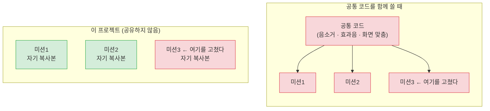

# 발표 예상 질문 (FAQ)

발표·심사에서 나올 만한 기술 질문과, 실제 코드·공식 문서로 확인한 답을 모아 둔다.
시스템 구성 자체에 대한 설명은 [기술 및 서비스 구성](tech-stack.md)을,
용어 풀이는 [기술 용어 설명](glossary.md), 실행 원리는 [앱이 태블릿에서 실행되기까지](how-it-runs.md)를 참고.

---

## 왜 Cloudflare Pages인가? 정적 파일뿐이면 GitHub Pages로도 되지 않나?

**짧은 답** — 앱 자체는 GitHub Pages에서도 그대로 돌아간다. 고쳐야 할 코드는 없다.
다만 ① 레포가 private이라 무료 플랜으로는 쓸 수 없고, ② 앱이 들어 있는 `www/` 폴더를
발행 폴더로 지정할 수 없어서 Cloudflare Pages를 골랐다. 앱의 문제가 아니라 호스팅 쪽 제약이었다.

### 앱 쪽은 호환 문제가 없다

하위 경로 배포(`user.github.io/HeartGuardiansApp/`)에서 제일 자주 깨지는 게 경로인데, 이 앱은 해당 없다.

| 항목                              | 확인 결과                                                                 |
| --------------------------------- | ------------------------------------------------------------------------- |
| 루트 절대경로(`src="/assets/..."`) | **0건** — 모든 경로가 상대경로 (`ROOT`가 페이지 깊이별로 `""` / `"../"` / `"../../"`) |
| 페이지 이동                       | `location.href = ROOT + "auth/index.html"` — 전부 상대경로                 |
| API 호출                          | Workers 주소를 **절대 URL**로 호출 + CORS 와일드카드 → 호스팅 위치와 무관   |
| SPA 폴백(`_redirects`) 필요 여부  | 불필요 — MPA라 모든 URL에 실제 `index.html` 파일이 존재                     |
| 사이트 용량                       | 78 MB (436개 파일, 최대 파일 10.9 MB) → Pages 상한 **1 GB** 안쪽            |

### 걸리는 것 세 가지

**1. private 레포 — 가장 큰 벽**

> "If the account that owns the repository uses GitHub Free or GitHub Free for organizations,
> the repository must be public."
> — [GitHub Docs · Creating a GitHub Pages site](https://docs.github.com/en/pages/getting-started-with-github-pages/creating-a-github-pages-site)

`HeartGuardiansApp`은 private이다. 무료 플랜이면 **레포를 공개로 돌리거나 유료 플랜(Pro)으로
올려야** 한다. 게다가 게시된 사이트는 레포가 private이어도 **인터넷에 그대로 공개된다**
(접근 제어는 Enterprise Cloud 전용). Cloudflare Pages는 private 레포를 무료로 연결할 수 있고,
필요하면 Cloudflare Access로 접근 제한도 걸 수 있다.

**2. 발행 폴더를 `www/`로 지정할 수 없다**

GitHub Pages는 브랜치 배포 시 소스 폴더로 **저장소 루트(`/`) 또는 `/docs`** 둘만 허용한다.
이 앱은 `www/`에 있고, 그 이름은 Capacitor의 `webDir: "www"`와 묶여 있다. 그래서 셋 중 하나를 해야 한다.

- `www/` → `docs/`로 이름 변경 (+ `capacitor.config.json` 수정) — 문서 폴더와 이름이 겹쳐 혼란
- `gh-pages` 브랜치에 `www/` 내용만 따로 푸시
- GitHub Actions 워크플로로 `www/`를 업로드

Cloudflare Pages는 대시보드 output 디렉터리에 **`www`라고 적으면 끝**이고 빌드 명령도 없다.
(이 프로젝트는 예전에 GitHub Actions 배포를 시도했다가 되돌린 적이 있다 — 배포 자격증명을
Cloudflare 한쪽에 두는 편이 단순해서였다.)

**3. 대역폭**

GitHub Pages는 월 **100 GB 소프트 제한**이다. 캐시 없는 풀 로드가 78 MB니까 단순 계산으로
월 약 **1,300회** — 30명 학급 기준 약 43개 학급분. 동영상·3D 모델이 무거운 앱이라 여유가 많지 않다.
Cloudflare Pages는 대역폭 무제한이고 애초에 CDN 제품이다.
([GitHub Pages 사용 한도](https://docs.github.com/en/pages/getting-started-with-github-pages/github-pages-limits))

덧붙여 GitHub Pages 약관에는 상업적 서비스 호스팅 금지 조항이 있다. 교육용이라 문제될 일은
아니지만 사업화한다면 걸린다.

### APK는 호스팅과 무관하다

`www/` 전체가 APK 안에 들어가므로, 태블릿에서 돌아가는 최종 앱은 **어디에 호스팅하든 상관없다.**
웹 호스팅은 "브라우저로도 해 볼 수 있게" 하는 부가 경로일 뿐이다.

### 비교

|                          | GitHub Pages                 | Cloudflare Pages (채택) |
| ------------------------ | ---------------------------- | ----------------------- |
| 정적 파일 서빙           | 가능                         | 가능                    |
| private 레포             | 무료 플랜 불가 (공개 or 유료) | 가능                    |
| 출력 폴더 `www` 지정     | 불가 (`/` 또는 `/docs`만)     | 대시보드에서 지정       |
| 대역폭                   | 100 GB/월 소프트 제한         | 무제한                  |
| 이 앱의 경로·API 호환성  | 문제없음                      | 문제없음                |

---

## 왜 React 같은 프레임워크도, 번들러도 쓰지 않았나?

**짧은 답** — **미션 하나를 독립된 HTML 파일 한 장으로 유지**하기 위해서다.
그래야 ① 이 프로젝트 밖에서 따로 만든 미션을 변환 없이 그대로 가져다 붙일 수 있고,
② 한 미션을 고치다 실수해도 다른 미션이 망가지지 않는다.

### 목표 — "미션 하나 = 혼자서도 돌아가는 HTML 한 장"

이 게임은 미션 단위로 화면이 나뉜다. 미션 하나를 **이 프로젝트와 상관없이 따로 만들어서**,
다 되면 **폴더째 가져와 이어 붙이는 것**이 목표였다. 누가 만들었는지는 따지지 않는다 —
혼자 돌아가는 HTML 한 장이기만 하면 된다.

흔히 쓰는 선택지들은 전부 이 목표와 충돌했다.

| 흔한 선택               | 왜 안 맞았나                                             |
| ----------------------- | --------------------------------------------------------- |
| 번들러 (Vite · webpack) | 붙이기 전에 **변환(빌드) 단계**를 거쳐야 한다              |
| React · Vue             | HTML을 **컴포넌트로 고쳐 써야** 한다                       |
| SPA                     | 미션이 **앱 전체의 일부**가 되어 따로 떼어낼 수 없다       |
| 페이지 간 js·css 공유   | 그 폴더만 들고 와도 **안 돌아간다**                        |

그래서 넷 다 쓰지 않았다.

### 두 번째 이유 — 사고가 옆으로 번지지 않는다

공통 코드를 여러 화면이 함께 쓰면, **미션3을 작업하다 공통 파일을 잘못 건드렸을 때
미션3은 멀쩡한데 잘 돌던 미션1이 망가진다.** 더 나쁜 건, 작업자는 미션3만 확인하고
넘어가므로 **그 사실을 한참 뒤에야 안다**는 점이다.

이 프로젝트는 페이지끼리 js·css를 공유하지 않는다. 그래서 **무엇을 어떻게 고치든
망가질 수 있는 범위가 그 폴더 하나**로 묶인다.

빨간색이 **미션3을 고쳤을 때 함께 위험해지는 범위**다.

**〈공통 코드를 함께 쓸 때〉** 는 미션3 하나를 건드렸는데 **셋 다 위험해진다.**
**〈이 프로젝트〉** 는 **고친 그 하나만** 위험하다.
그리고 앞쪽의 진짜 문제는, 작업자가 미션3만 확인하고 넘어가므로 **미션1이 깨진 걸 모른다**는 점이다.

### 실제로 그렇게 되어 있다

| 확인 항목                | 결과                                                          |
| ------------------------ | -------------------------------------------------------------- |
| 미션 폴더 구성           | `index.html` + `script.js` + `style.css` (3D 월드만 `world/` 추가)   |
| 폴더 밖의 js·css 참조    | **25개 페이지 전부 없음** — 20개는 자기 폴더의 `script.js` · `style.css`, 5개는 아예 인라인 |
| 유일한 예외              | 개발용 테스트 계정 파일 하나 (APK 빌드 때 제거된다)              |
| 커밋 기록                | 씬마다 "프롤로그 **이식**", "미션2(공감 나침반 작전) **이식**"   |

설계 의도로만 남은 게 아니라, 실제 작업 방식이 그랬고 폴더 구조가 그걸 강제한다.

### 대가 — 중복

공통 코드(음소거 · 효과음 · 화면 맞춤 등)는 페이지마다 복사되어 있다.
그래서 **공통 블록을 하나 고치면 모든 페이지에 같은 수정을 반복해야 한다.**

이건 실수가 아니라 맞바꾼 것이다.

> **"수정을 전파하는 비용"을 내고, "사고가 전파되는 위험"을 없앴다.**

전체 화면이 스물다섯 개쯤이고 한 번 완성되면 잘 바뀌지 않는 교육용 게임에서는,
고칠 때 번거로운 쪽보다 **모르는 사이에 다른 미션이 깨지는 쪽**이 훨씬 위험하다고 봤다.

### 다만 — 숙련된 개발 방식은 아니다

분명히 해 둘 것이 있다. 이 방식은 **초보자도 손댈 수 있게 하려고 고른 것**이지,
일반적으로 권장되는 개발 방식이 아니다.

규모가 크거나 여러 개발자가 오래 유지보수하는 소프트웨어는 **정반대로 간다.**

| 보통의 개발                      | 이 프로젝트                        |
| -------------------------------- | ---------------------------------- |
| 공통 코드를 한 곳에 모은다        | 페이지마다 복사한다                |
| 중복은 가장 먼저 없앨 대상이다    | 중복을 **일부러** 남긴다           |
| 컴포넌트로 만들어 재사용한다      | 재사용하지 않는다                  |
| 빌드 도구로 검사·최적화한다       | 빌드 단계가 없다                   |

정석대로라면 중복은 **가장 먼저 제거해야 할 냄새**다. 고칠 곳이 여러 군데로 흩어지고,
하나를 빠뜨리면 화면마다 동작이 달라지기 때문이다. 실제로 이 프로젝트도 그 부담을 지고 있다.

그럼에도 이렇게 한 이유는 세 가지다.

1. **만드는 사람이 개발 전문가가 아닐 수 있다.** 미션 한 장을 따로 만들어 넣는 데
   프로젝트 전체 구조를 이해해야 한다면 손을 못 댄다.
2. **한 번 완성된 미션은 잘 바뀌지 않는다.** 공통 코드를 고칠 일 자체가 드물다.
3. **규모가 작고 수명이 정해져 있다.** 화면 스물다섯 개짜리 교육용 앱이다.

셋 중 하나라도 달라지면 — 규모가 커지거나, 개발자가 여럿 붙거나, 오래 유지보수해야 한다면
— **이 선택은 바뀌어야 한다.** 좋은 방식이라서 고른 게 아니라,
**이 상황에서 사고가 가장 덜 나는 방식**이라서 골랐다.

---

## 선생님 콘솔은 왜 API를 거치지 않고 데이터베이스에 직접 붙나?

**짧은 답** — **데이터베이스가 직접 권한을 판단할 수 있기 때문이다.**
판단해 줄 사람이 이미 안에 있으니, 중간에 문지기를 한 번 더 둘 이유가 없다.

### 같은 앱인데 경로가 둘이다

| 누가            | 어떻게 접근하나                         | 왜                                   |
| --------------- | ---------------------------------------- | ------------------------------------- |
| 학생            | 앱 → **API 서버** → 데이터베이스         | 데이터베이스가 학생을 알아보지 못한다  |
| 선생님 · 운영자 | 콘솔 → **데이터베이스** (직접)           | 데이터베이스가 선생님을 알아본다       |

갈림길은 하나다. **데이터베이스가 "지금 요청한 사람이 누구인지" 아느냐.**

- **선생님**은 Supabase Authentication 으로 로그인한다. 로그인하면 신분증(토큰)이 나오고,
  데이터베이스는 그 신분증을 보고 **"아, 이 선생님이구나"** 하고 안다.
- **학생**은 그런 계정이 없다. 학교 · 학년 · 반 · 번호 · PIN 이 전부다.
  데이터베이스 입장에서는 누가 요청했는지 알 길이 없다.
  그래서 **API 서버가 대신 확인해 주고**, 확인된 것만 데이터베이스에 묻는다.

즉 두 경로는 서로 다른 원칙이 아니라 **같은 원칙의 두 결과**다.

> **데이터베이스가 요청자를 알아보면 데이터베이스가 직접 판단하고,
> 알아보지 못하면 서버가 대신 확인한다.**

### 데이터베이스가 판단한다는 게 무슨 뜻인가

Supabase 의 **RLS(행 수준 보안)** 기능이다. 표의 줄 하나하나마다
"이 사람이 이 줄을 봐도 되는가"를 데이터베이스가 검사한다.

- 선생님 → **자기 반 학생의 줄만** 보인다
- 운영자 → 전체가 보인다
- 그 밖 → 아무것도 보이지 않는다

선생님 콘솔 화면이 "전체 학생을 주세요"라고 요청해도, **돌아오는 것은 자기 반뿐이다.**

### 문지기를 두는 것보다 안전할 수 있다

얼핏 "중간에 서버를 한 번 거치는 쪽이 더 안전하지 않나" 싶지만, 꼭 그렇지는 않다.

| | 서버가 문지기일 때                      | 데이터베이스가 판단할 때              |
| --- | --------------------------------------- | -------------------------------------- |
| 규칙이 있는 곳 | 서버 코드 여기저기                     | **데이터베이스 한 곳**                  |
| 새 기능 추가 시 | 그 기능에도 검사를 **빠뜨리지 않아야** 한다 | 새 경로에도 **자동으로 적용된다**       |
| 실수했을 때 | 그 구멍으로 뚫린다                       | 화면이 무엇을 요청하든 데이터베이스가 거부 |

규칙을 **한 곳에 모아 두고 모든 경로에 똑같이 적용**하는 쪽이, 경로마다 검사를 되풀이하는 것보다
빠뜨릴 여지가 적다.

### 공개키가 브라우저에 노출되는데 괜찮나

선생님 콘솔은 브라우저에서 데이터베이스를 부르므로, 연결용 키(publishable key)가 화면 코드에 들어 있다.
이건 **공개되어도 되는 값**이다.

그 키는 "어느 프로젝트에 연결할지"를 가리킬 뿐, **"당신이 누구인지"를 증명하지 않는다.**
권한은 로그인해서 받은 신분증과 RLS 가 정한다.
키만 알아내도 **로그인하지 않으면 아무것도 보이지 않는다.**

관련 구성은 [기술 및 서비스 구성](tech-stack.md)의 "인증 — 두 갈래"에 정리되어 있다.

---

**문서 이동** — [목록](./) · [배포와 서버](deploy-and-server.md) · [기술 구성](tech-stack.md) · [실행 원리](how-it-runs.md) · **FAQ** · [용어 설명](glossary.md) · [Git 안내](git-basics.md) · [개발 환경](dev-setup.md)
