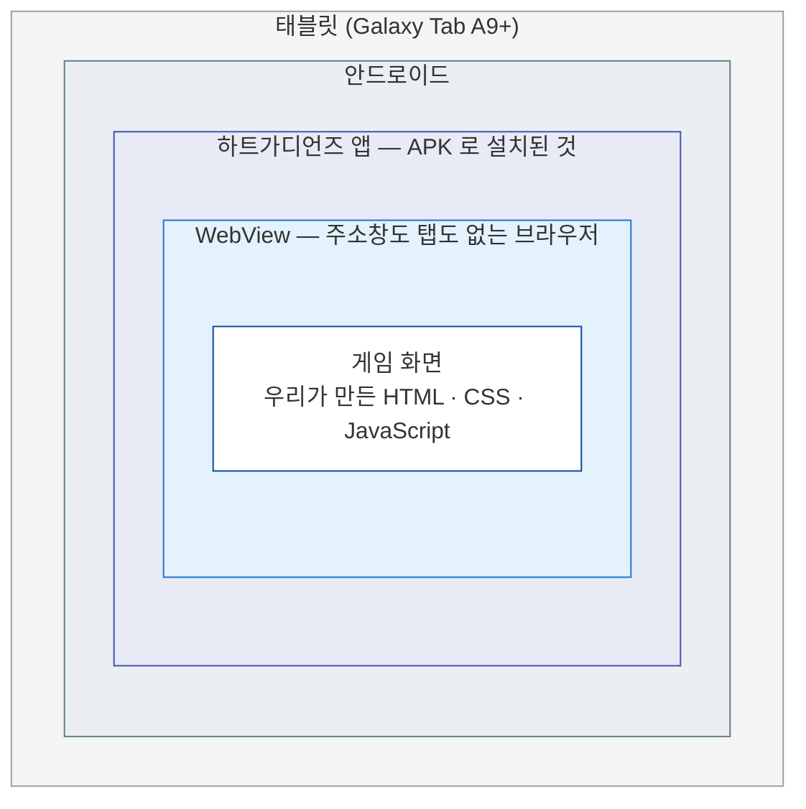

# 앱이 태블릿에서 실행되기까지

"웹사이트 만드는 기술로 만들었다는데, 어떻게 태블릿에 **앱으로 설치**되어 돌아가는가?"
발표에서 가장 많이 나올 질문이라 그림으로 풀어 둔다.

구성 요소 목록은 [기술 및 서비스 구성](tech-stack.md), 용어 풀이는 [기술 용어 설명](glossary.md) 참고.

> **한 줄로 말하면**
> 이 앱은 **주소창이 없는 브라우저를 품고 있는 앱**이다.
> 그 브라우저가 인터넷이 아니라 **태블릿 안에 들어 있는 게임 파일**을 연다.

---

## 1. 무엇이 무엇 안에 들어 있나



핵심은 **WebView** 한 칸이다.
안드로이드는 앱이 화면 안에 "브라우저 한 장"을 띄울 수 있게 해 주는데, 그게 WebView다.
우리는 그 브라우저 한 장을 **화면 전체로 키우고, 주소창과 탭을 없앴다.**
그래서 아이들 눈에는 브라우저가 아니라 그냥 게임으로 보인다.

## 2. 설치 파일(APK) 안에 든 것

APK는 태블릿에 설치되는 **파일 하나**다. 그 안에 세 가지가 들어 있다.

```
APK
│
├─ ① 안드로이드 껍데기
│     "화면 가득 브라우저를 띄우고, 그 안에 ②를 열어라"
│     라는 짧은 지시가 전부다.
│
├─ ② 게임 전체 — www 폴더  (파일 436개, 78 MB)
│     HTML · CSS · JavaScript
│     그림 · 영상 · 소리 · 3D 모델
│
└─ ③ 기기 기능 연결 부품
      갤러리 저장처럼 웹 기술만으로는 못 하는 일을 대신한다.
```

**②가 통째로 APK 안에 들어간다**는 점이 중요하다.
게임에 필요한 그림·영상·소리·3D 모델이 전부 태블릿 안에 복사되어 있다.

## 3. 아이콘을 누르면 벌어지는 일

```
①  손가락으로 앱 아이콘을 누른다
     ↓
②  안드로이드가 앱을 켠다
     ↓
③  앱이 WebView 를 화면 가득 띄운다
     · 주소창 없음 · 탭 없음 · 상단 상태바와 하단 버튼도 숨김
     · 가로 방향으로 고정
     ↓
④  WebView 가 태블릿 안에 있는 게임 첫 화면을 연다
     · 인터넷에 나가지 않는다
     ↓
⑤  아이들 눈에는 그냥 게임 화면
```

③에서 상태바·네비게이션바까지 숨기는 것(몰입 모드)과 가로 고정은 앱 쪽 설정으로 강제한다.
그래서 **브라우저라는 흔적이 화면에 하나도 남지 않는다.**

## 4. 보통의 웹사이트와 무엇이 다른가

|                    | 보통의 웹사이트              | 하트가디언즈 앱                       |
| ------------------ | ---------------------------- | ------------------------------------- |
| 브라우저           | 크롬을 **내가 직접** 연다     | **앱이 브라우저 화면을 품고 있다**     |
| 무엇을 여는가      | 주소창에 친 **인터넷 주소**   | **태블릿 안에 있는 파일**              |
| 화면에 보이는 것   | 주소창 · 탭 · 뒤로가기 버튼   | **아무것도 없는 가로 전체화면**        |
| 인터넷이 없으면    | 아무것도 안 보인다            | **게임은 그대로 돌아간다**             |
| 설치               | 설치라는 개념이 없다          | 앱 목록에 아이콘이 생긴다              |

## 5. 인터넷은 언제 필요한가

| 무엇을 할 때                  | 인터넷      | 왜                                                    |
| ----------------------------- | ----------- | ------------------------------------------------------ |
| 게임 화면 · 영상 · 소리 · 3D  | **필요 없음** | 전부 APK 안에 들어 있어 태블릿에서 바로 읽는다          |
| 로그인                        | 필요        | 서버에 학생 정보를 확인해야 한다                        |
| 행성 완료 진도 저장           | 필요        | 실패해도 기기에 적어 뒀다가 **다음 로그인 때 다시 보낸다** |
| 선생님 콘솔                   | 필요        | 반 학생들의 자료를 실시간으로 본다                      |

실제로 앱 코드가 인터넷을 쓰는 곳은 **API 서버와 Supabase 두 곳뿐**이고,
화면을 그리는 데 필요한 파일은 **단 하나도 외부에서 불러오지 않는다.**

경계선을 그으면 이렇게 나뉜다.


> **그래서 — 교실 와이파이가 흔들려도 게임은 끊기지 않는다.**
> 진도 저장이 잠깐 실패해도 기기에 적어 뒀다가 다음에 다시 보내므로 기록도 잃지 않는다.

## 6. 이 방식의 장점과 한계

**장점**

- 웹 기술 하나로 **태블릿 앱과 웹 버전을 동시에** 만든다. 같은 코드가 양쪽에 쓰인다.
- 화면을 고치면 브라우저에서 바로 확인된다. 앱을 다시 설치하지 않아도 된다.
- 게임 자료가 전부 기기 안에 있어 **네트워크에 영향을 받지 않는다.**

**한계**

- 안드로이드 전용 언어로 만든 앱보다 무겁다. 브라우저 한 장을 통째로 띄우기 때문이다.
- 카메라·갤러리처럼 기기 기능을 쓰려면 **부품을 따로 만들어 붙여야 한다**(③).

---

**문서 이동** — [목록](./) · [배포와 서버](deploy-and-server.md) · [기술 구성](tech-stack.md) · **실행 원리** · [FAQ](faq.md) · [용어 설명](glossary.md) · [Git 안내](git-basics.md) · [개발 환경](dev-setup.md)
