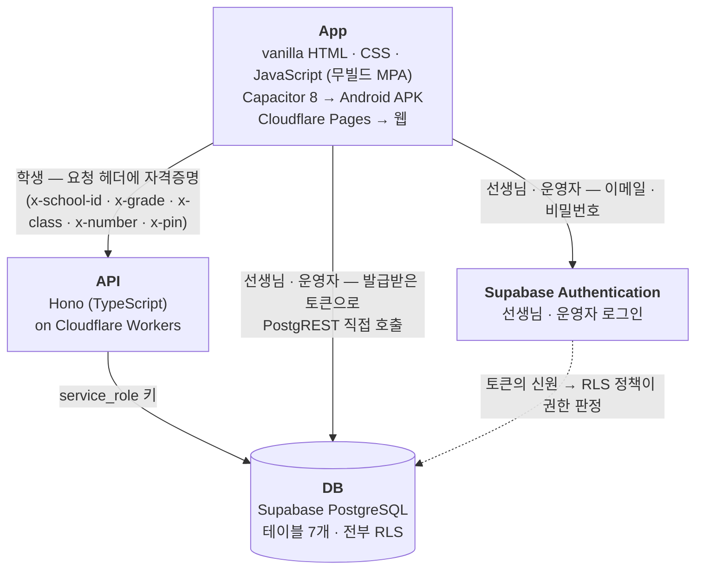

# 기술 및 서비스 구성

하트가디언즈 우주공감탐험대의 App · API · DB 구성 정리. (2026-09 기준)

> **한 줄 요약**
> 프레임워크 없는 순수 웹 기술로 만든 게임을 **Capacitor**로 안드로이드 APK로 패키징하고,
> **Cloudflare Workers**의 API를 통해 **Supabase PostgreSQL**과 통신한다.
> 선생님·운영자 인증은 **Supabase Authentication**이 담당한다.

## 1. 전체 구성



학생은 **API 서버를 거쳐서** DB에 접근하고, 선생님·운영자 콘솔은 **DB에 직접** 접근한다.
서로 다른 두 경로를 쓰는 이유는 [4. 인증](#4-인증--두-갈래)에서 설명한다.

## 2. 사용한 외부 서비스 — 두 곳

| 서비스         | 제품               | 용도                                     |
| -------------- | ------------------ | ---------------------------------------- |
| **Cloudflare** | Workers            | API 서버 호스팅                          |
|                | Pages              | 웹 앱 호스팅 (`www/`를 무빌드로 서빙)    |
| **Supabase**   | PostgreSQL         | 앱 시나리오에 필요한 모든 데이터 저장    |
|                | Authentication     | 선생님 · 운영자 로그인                   |

운영자·선생님 화면은 예전에 별도 사이트(Vercel)로 있었지만, 지금은 앱 안(`www/teacher/`)에 내장되어 있다.

## 3. 계층별 상세

### App — 웹앱을 APK로 패키징

> 웹으로 만든 것이 어떻게 태블릿에서 앱으로 실행되는지는
> [앱이 태블릿에서 실행되기까지](how-it-runs.md)에 그림으로 풀어 두었다.

**코드**
순수 **HTML + CSS + JavaScript**. React·Vue 같은 프레임워크도, 번들러(Vite·webpack)도 쓰지 않는다.
**빌드 단계가 없어서** `www/` 폴더의 정적 파일이 그대로 앱이 된다.
화면(씬)마다 독립된 폴더(`index.html` + `script.js` + `style.css`)를 갖는 **MPA(Multi-Page Application)** 구조.

**왜 이렇게 했나 — "미션 하나 = 혼자서도 돌아가는 HTML 한 장"**
① 이 프로젝트 **밖에서 따로 만든 미션을 변환 없이 그대로 가져다 붙일 수 있다.**
누가 만들었든 혼자 돌아가는 HTML 한 장이면 폴더째 넣기만 하면 된다.
② 페이지끼리 js/css를 공유하지 않으므로, 한 미션을 고치다 실수해도
**망가질 수 있는 범위가 그 폴더 하나**다. 잘 돌던 다른 미션이 함께 깨지지 않는다.

대가로 공통 코드(음소거·효과음·화면 맞춤 등)는 페이지마다 복사되어 있다.
**초보자도 손댈 수 있게 하려고 고른 방식이지, 일반적으로 권장되는 개발 방식은 아니다** —
보통은 중복을 없애고 공통 코드를 한 곳에 모은다. 왜 반대로 갔는지는
[FAQ](faq.md)의 "왜 React 같은 프레임워크도, 번들러도 쓰지 않았나" 참고.

**패키징 — Capacitor 8.4.1**
웹앱을 안드로이드 WebView에 담아 APK로 만드는 도구.

- `appId: com.heartguardians.app`, `webDir: "www"`
- 대상 기기: **Galaxy Tab A9+** — 가로 고정 · 전체화면(immersive)
- 레이아웃 기준 1280 × 800 CSS px (물리 1920 × 1200 ÷ DPR 1.5)
- `minSdk 29` / `compileSdk` · `targetSdk 36`

**Capacitor 플러그인**

| 플러그인                   | 용도                                    |
| -------------------------- | --------------------------------------- |
| `@capacitor/app`           | 하드웨어 뒤로가기 버튼 처리             |
| `@capacitor/filesystem`    | 파일 저장                               |
| `@capacitor/inappbrowser`  | 외부 링크 열기 (학급 게시판 등)         |
| `@capacitor/share`         | 수료증 공유                             |
| `GalleryPlugin` (자체 제작) | 안드로이드 MediaStore로 갤러리에 이미지 저장 |

**사용한 브라우저 표준 기술**

| 기술                     | 쓰인 곳                                                              |
| ------------------------ | -------------------------------------------------------------------- |
| **three.js** (r185)      | 행성3 미션의 3D 월드. GLTFLoader로 3D 모델 로드                       |
| **Web Audio API**        | 효과음 재생과 배경 앰비언스 합성 (22개 화면)                          |
| **Canvas + Web Worker**  | 수료증 이미지 생성. PNG 인코딩을 워커로 분리해 태블릿에서 4초 → 71ms  |
| **localStorage**         | 로그인 세션 · 진도 · 음소거 상태 보관                                 |
| **CSS 절대배치 + 스케일링** | 무대(stage)를 letterbox로 축소·확대해 어떤 화면 비율에서도 동일하게 표시 |

**Node.js는 어디에 쓰였나**
서버 런타임이 아니라 **개발 도구 런타임**이다 (Node 22).

- npm — 패키지 관리
- browser-sync — 로컬 개발 서버 (`npm run dev`)
- APK 빌드 자동화 스크립트 (`cap sync` → Gradle 빌드 → `adb install`)
- 공모전 제출본 스테이징 스크립트, Prettier 포매팅

**웹 배포**
Cloudflare Pages. 빌드 명령 없이 출력 디렉터리 `www`를 그대로 서빙한다. 같은 코드가 APK와 웹 양쪽에 쓰인다.

### API — Cloudflare Workers 위의 Hono

**언어 · 프레임워크**
**TypeScript + Hono 4** (경량 웹 프레임워크).
Cloudflare Workers는 Node.js 서버가 아니라 **V8 isolate 기반 서버리스 런타임**으로, 요청이 들어오면 엣지에서 실행된다.

**함께 쓴 라이브러리**

| 라이브러리                              | 용도                                                      |
| --------------------------------------- | --------------------------------------------------------- |
| `@hono/zod-openapi`, `@hono/swagger-ui` | 코드에서 **OpenAPI 3.0 문서 자동 생성**, `/api/docs`에 Swagger UI 제공 |
| `zod`                                   | 요청 · 응답 스키마 검증                                    |
| `@supabase/supabase-js`                 | DB 접근 (`service_role` 키)                                |
| `vitest`                                | 통합 테스트                                                |
| `wrangler`                              | 배포 CLI. main 브랜치 머지 시 자동 배포                     |

**역할** — 앱이 DB에 직접 붙지 않게 하는 중간 계층.

| 엔드포인트                                        | 하는 일                          |
| ------------------------------------------------- | -------------------------------- |
| `POST /api/auth/signup`, `POST /api/auth/verify`  | 학생 가입 · 로그인               |
| `GET /api/schools`, `/schools/{id}/open-classes`  | 학교 목록 · 개설된 반 목록       |
| `GET`·`DELETE /api/me`                            | 내 정보 조회 · 탈퇴              |
| `GET /api/progress`, `PUT /api/progress/{planet}` | 진도 조회 · 행성 완료 저장       |
| `GET /api/planet-reviews`                         | 행성별 소감 조회                 |
| `POST`·`GET /api/planet2/emotion-guide/...`       | 감정 가이드 응답 제출 · 반 전체 조회 |
| `GET /api/class-board`                            | 학급 게시판 링크 조회            |

### DB — Supabase PostgreSQL

**PostgreSQL** — 관계형 데이터베이스(RDBMS). 테이블 7개, **전부 RLS(Row Level Security) 활성**.

| 테이블                       | 내용                                       |
| ---------------------------- | ------------------------------------------ |
| `schools`                    | 학교                                       |
| `profiles`                   | 학생 (학교 · 학년 · 반 · 번호 · PIN · 진도) |
| `planet_reviews`             | 행성 완료 소감                             |
| `emotion_guide_submissions`  | 행성2 감정 가이드 응답                     |
| `class_boards`               | 학급 게시판 URL                            |
| `teachers`                   | 선생님                                     |
| `admins`                     | 운영자                                     |

## 4. 인증 — 두 갈래

같은 앱 안에 성격이 전혀 다른 두 사용자가 있어서, 인증도 두 갈래로 나뉜다.

### 학생 — 자체 방식 (DB 테이블)

세션이나 토큰 없이, 보호된 요청마다 헤더에 자격증명을 실어 보낸다.

```
x-school-id: <학교 UUID>
x-grade: <학년>
x-class: <반>
x-number: <번호>
x-pin: <4자리 PIN>
```

초등학생이 쓰는 교육용 앱이라 **의도적으로 단순화한 방식**이다. 학생 계정 정보는 `profiles` 테이블에 있고,
검증은 API 서버가 `service_role` 키로 DB를 조회해 수행한다.

### 선생님 · 운영자 — Supabase Authentication

DB 테이블이 아니라 **Supabase가 제공하는 Authentication 기능**을 쓴다.

- 이메일 + 비밀번호 로그인
- access token + refresh token 발급 (refresh token은 회전 방식)
- 가입 시 `auth.users` INSERT 트리거(`handle_new_user`)가 `teachers` 행을 자동 생성

**여기서 구조적으로 눈여겨볼 점** — 선생님 콘솔은 **API 서버를 거치지 않고 Supabase에 직접 접속한다**
(Auth REST + PostgREST). 브라우저에 노출되는 공개키(publishable key)를 쓰지만,
실제 권한 경계는 **DB의 RLS 정책**(`teacher_owns` / `is_admin`)이 강제한다.
클라이언트가 무엇을 요청하든 자기 반 데이터만 보이는 것은 DB가 보장한다.

즉 **학생 데이터는 API 서버가 지키고, 선생님 데이터는 DB가 직접 지키는** 이중 구조다.

## 5. 발표용 정리

| 계층    | 핵심 기술                                  | 호스팅                     |
| ------- | ------------------------------------------ | -------------------------- |
| **App** | HTML · CSS · JavaScript (무빌드) + Capacitor 8 | APK(기기) · Cloudflare Pages(웹) |
| **API** | TypeScript + Hono 4                        | Cloudflare Workers         |
| **DB**  | PostgreSQL + Supabase Authentication       | Supabase                   |

**이 구성의 특징**

- **빌드 도구가 없다** — 소스가 곧 실행물이라 구조가 단순하고, 같은 코드가 웹과 APK 양쪽에 쓰인다.
- **서버를 직접 운영하지 않는다** — 서버리스(Workers) + 관리형 DB(Supabase)라 인프라 관리 부담이 없다.
- **외부 서비스는 두 곳뿐** — Cloudflare와 Supabase.

---

발표·심사에서 나올 만한 질문과 답은 [발표 예상 질문 (FAQ)](faq.md)에 따로 모아 둔다.
앱이 태블릿에서 실행되는 원리는 [앱이 태블릿에서 실행되기까지](how-it-runs.md),
용어가 낯설다면 [기술 용어 설명](glossary.md)을 참고.
